<table>
  <tr>
    <th></th>
    <th>Logo</th>
    <th>Type</th>
    <th></th>
  </tr>
  <tr>
    <td>White</td>
    <td>
      
    </td>
    <td>
      
    </td>
    <td>#FFF</td>
  </tr>
  <tr>
    <td>Black</td>
    <td>
      
    </td>
    <td>
      
    </td>
    <td>#333</td>
  </tr>
</table>
<table>
  <tr>
    <th colspan="3">Color</th>
  </tr>
  <tr>
    <td>White</td>
    <td>
      
    </td>
    <td>#FFF</td>
  </tr>
  <tr>
    <td>Black</td>
    <td>
      
    </td>
    <td>#333</td>
  </tr>
</table>
<table>
  <tr>
    <th colspan="8">Desktop Screenshots</th>
  </tr>
  <tr>
    <td colspan="3"></td>
    <td>
      <a href="https://raw.githubusercontent.com/precursorapp/press/master/screens-desktop/home.png">
        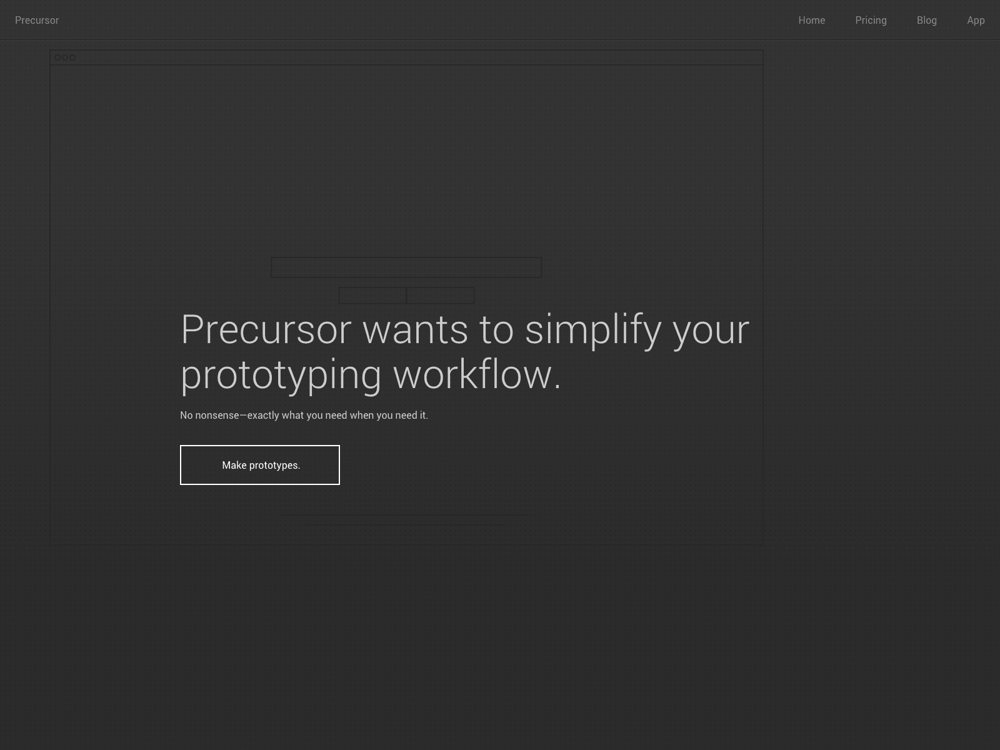
      </a>
    </td>
    <td>
      <a href="https://raw.githubusercontent.com/precursorapp/press/master/screens-desktop/canvas.png">
        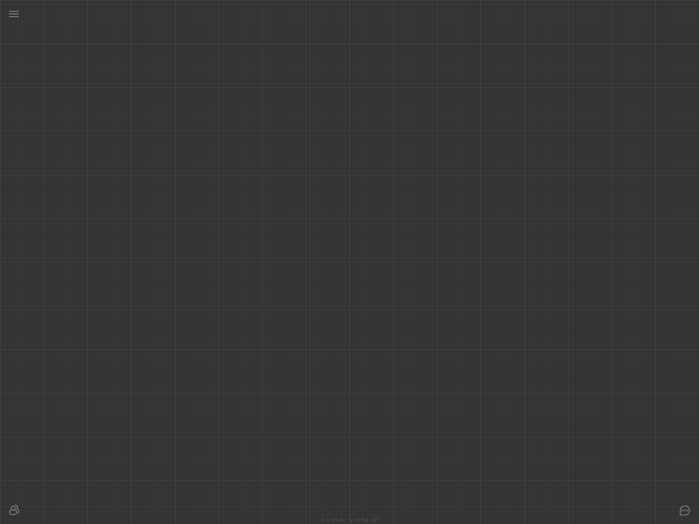
      </a>
    </td>
    <td colspan="3"></td>
  </tr>
  <tr>
    <td colspan="3"></td>
    <td>
      <a href="https://raw.githubusercontent.com/precursorapp/press/master/screens-desktop/team.png">
        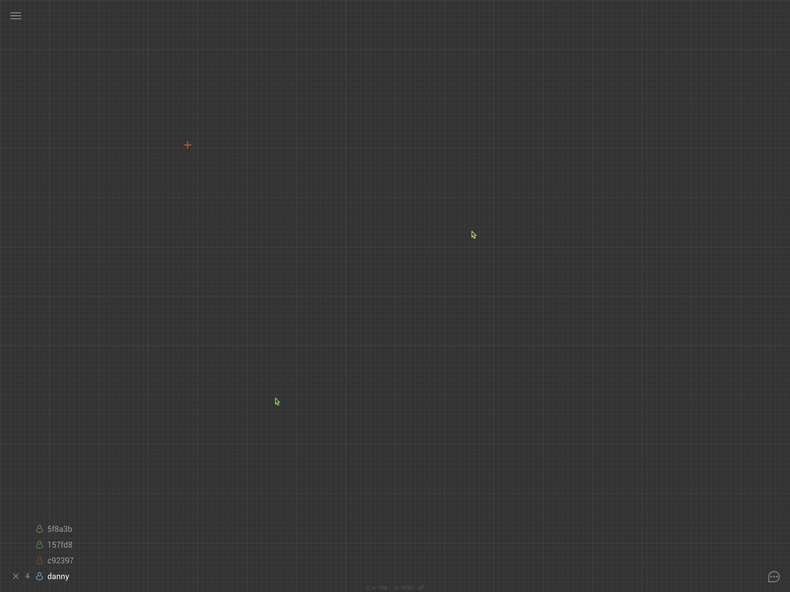
      </a>
    </td>
    <td>
      <a href="https://raw.githubusercontent.com/precursorapp/press/master/screens-desktop/collaborate.png">
        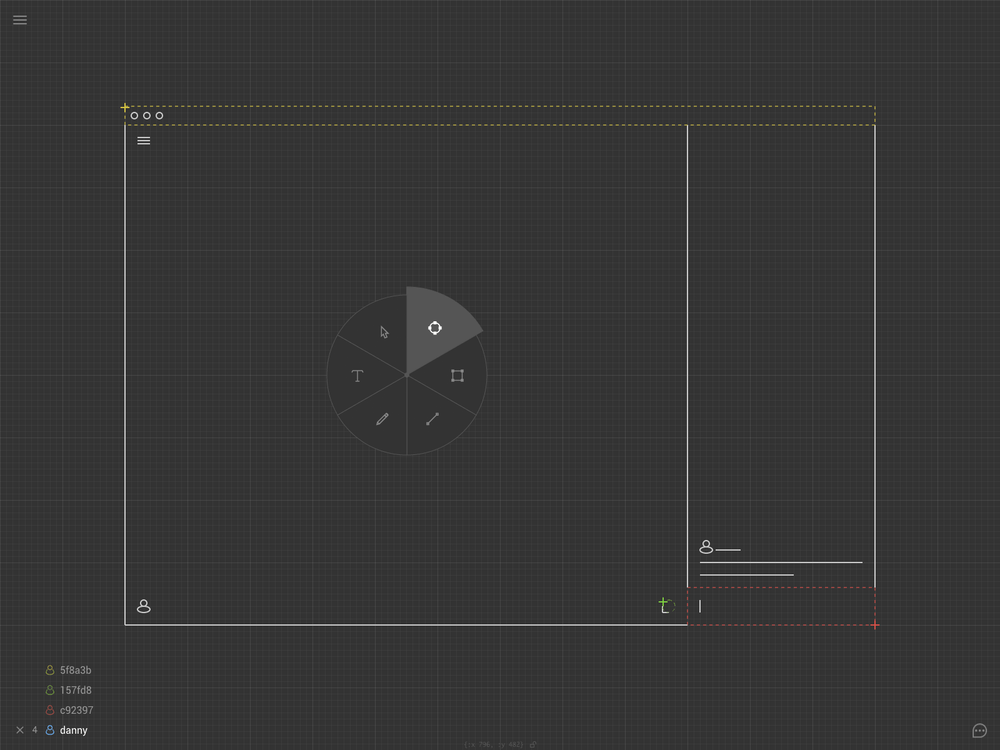
      </a>
    </td>
    <td colspan="3"></td>
  </tr>
  <tr>
    <td colspan="3"></td>
    <td>
      <a href="https://raw.githubusercontent.com/precursorapp/press/master/screens-desktop/chat.png">
        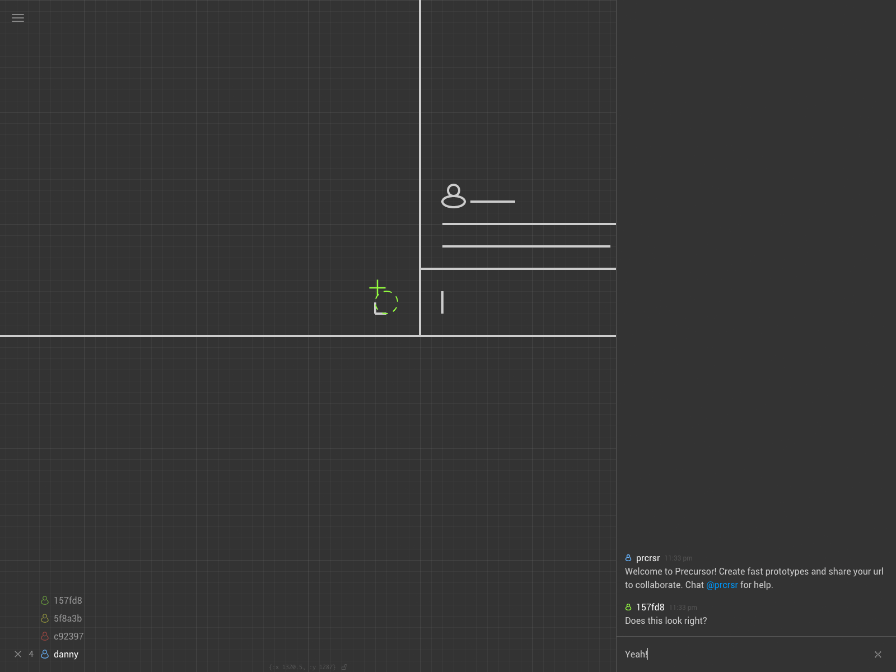
      </a>
    </td>
    <td>
      <a href="https://raw.githubusercontent.com/precursorapp/press/master/screens-desktop/menu.png">
        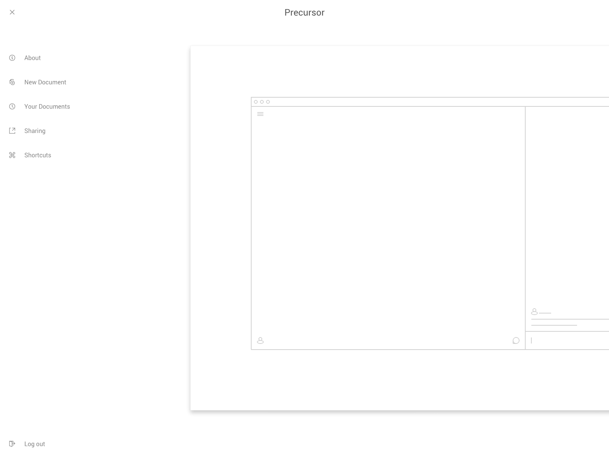
      </a>
    </td>
    <td colspan="3"></td>
  </tr>
</table>
<table>
  <tr>
    <th colspan="3">Mobile Screenshots</th>
  </tr>
  <tr>
    <td>
      <a href="https://raw.githubusercontent.com/precursorapp/press/master/screens-iphone6/home.png">
        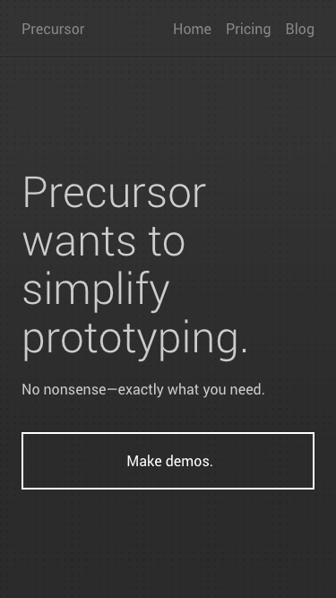
      </a>
    </td>
    <td>
      <a href="https://raw.githubusercontent.com/precursorapp/press/master/screens-iphone6/canvas.png">
        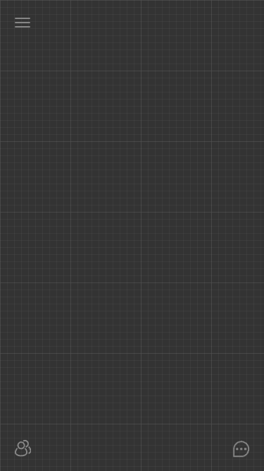
      </a>
    </td>
    <td>
      <a href="https://raw.githubusercontent.com/precursorapp/press/master/screens-iphone6/chat.png">
        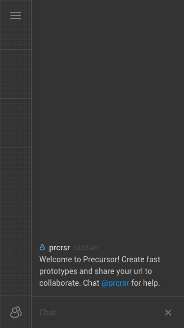
      </a>
    </td>
  </tr>
  <tr>
    <td>
      <a href="https://raw.githubusercontent.com/precursorapp/press/master/screens-iphone6/menu.png">
        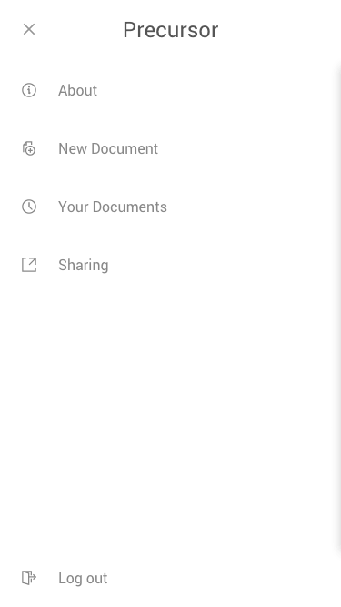
      </a>
    </td>
    <td>
      <a href="https://raw.githubusercontent.com/precursorapp/press/master/screens-iphone6/wireframe.png">
        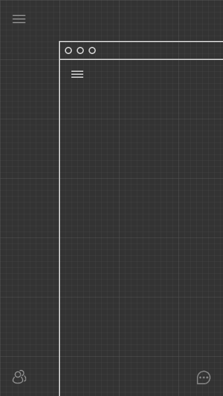
      </a>
    </td>
    <td>
      <a href="https://raw.githubusercontent.com/precursorapp/press/master/screens-iphone6/recent.png">
        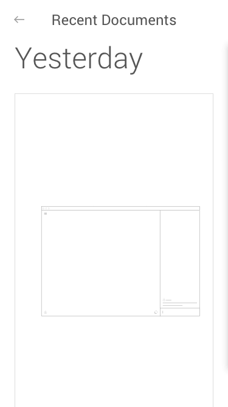
      </a>
    </td>
  </tr>
</table>
