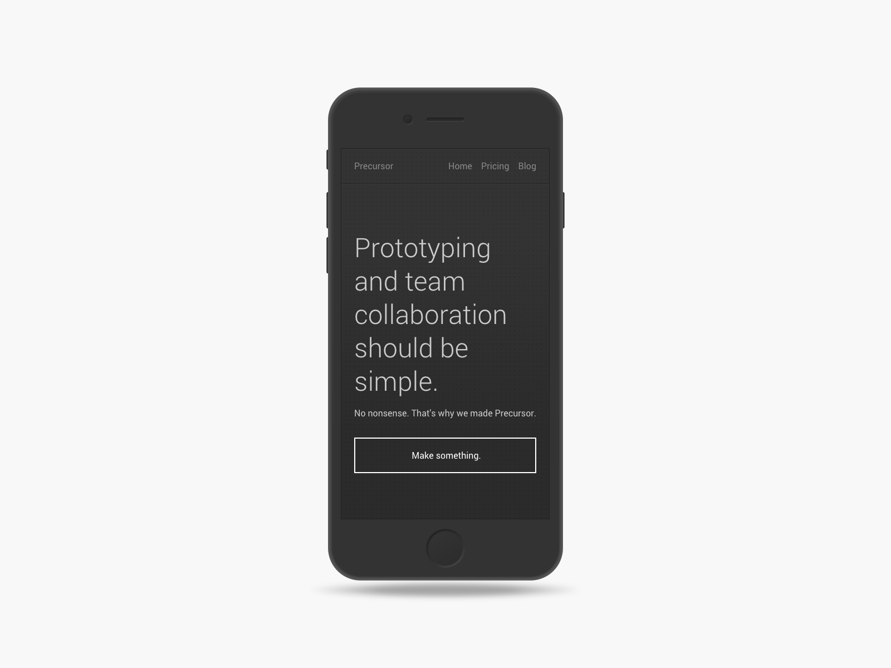
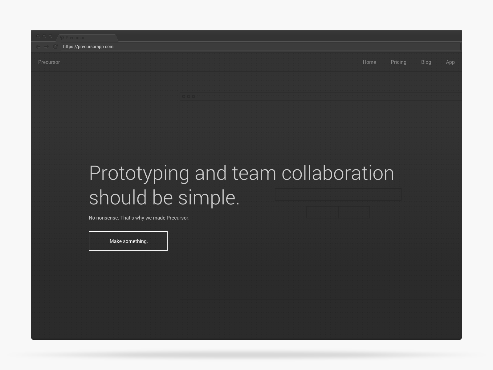

Precursor
===
Email [press@precursorapp.com](mailto:press@precursorapp.com) for press inquiries.  
Download [this press kit](/PrecursorApp/press/archive/master.zip) for quick use.  
Visit [precursorapp.com](https://precursorapp.com/home) for more information.  
<table>
  <tr>
    <th>logo</th>
  </tr>
  <tr>
    <td>
      
    </td>
  </tr>
  <tr>
    <th>type</th>
  </tr>
  <tr>
    <td>
      
    </td>
  </tr>
  <tr>
    <th>phone</th>
  </tr>
  <tr>
    <td>
      
    </td>
  </tr>
  <tr>
    <th>desktop</th>
  </tr>
  <tr>
    <td>
      
    </td>
  </tr>
</table>

Previously
===
- [Cognitect—Clojure Success Stories](http://cognitect.com/clojure)
- [Product Hunt—Precursor](http://www.producthunt.com/posts/precursor)
- [Abduzeedo—Sites of the Week](http://abduzeedo.com/sites-week-exposure-theme-giveaway-themefuse)
- [Nikita Prokopov—Codefest 2015](http://tonsky.me/talks/2015-codefest/)
- [Jacek Kłosiński—Malinki #55](http://klosinski.net/malinki-55/)
- [BlogDuWebdesign.com—Discover Precursor!](http://www.blogduwebdesign.com/service-web/outil-prototype-collaboration-precursor/1717)
